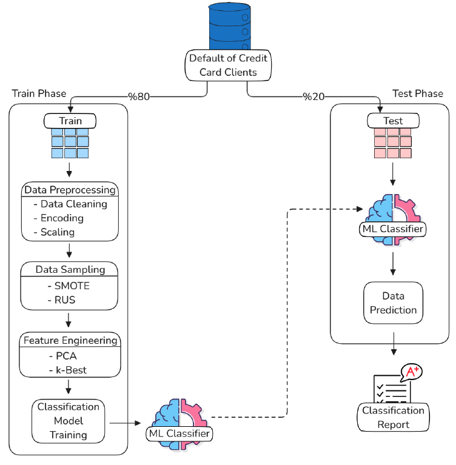

## Enhancing Credit Risk Assessment with Federated Learning through A Comparative Study
### Table of Contents
1. [Introduction](#introduction)
2. [Methodology](#methodology)
3. [Datasets](#datasets)
4. [Getting Started](#getting-started)
5. [Experiments](#experiments)
6. [Results](#results)
7. [Contributing](#contributing)
8. [Citation](#citation)

### Introduction
This repository contains the code used in our study, 
**"Enhancing Credit Risk Assessment with Federated Learning through A Comparative Study"**.
In this research, we explore the application of Federated Learning (FL) in predicting credit risk 
without sharing raw data, thereby maintaining data privacy. We use methods like Central ML, FedAvg, 
and the novel FedF1 and compare them across 5 machine learning algorithms.
For the complete paper, please visit [Will be updated].
    <div style="display: flex; flex-wrap: wrap;">
    <div style="flex: 50%; padding: 1px;">
      
    </div>
    </div>


### Methodology
- The study employs Federated Learning to predict credit card default while preserving user privacy.
- We compared multiple models including:
  - **Logistic Regression**, **Multi-Layer Perceptron**, **Support Vector Machine**, **XGBoost**, and **Random Forest**.
- The models were trained using both Central and Federated Learning approaches (FedAvg and FedF1).
- We used preprocessing techniques such as **Standard Scaling**, **SMOTE**, **Random Under Sampling (RUS)**, and **PCA** 
to handle the class imbalance and reduce feature dimensions.
    <div style="display: flex; flex-wrap: wrap;">
    <div style="flex: 50%; padding: 1px;">
      
    </div>
    </div>


### Datasets
The primary dataset used is the 
**"Default of Credit Card Clients in Taiwan"** (DCCC) dataset from the UCI Machine Learning Repository [citation].
It consists of 30,000 records and 24 attributes related to customers' demographic information and historical payment data.
**Dataset Link**: [UCI Repository](https://archive.ics.uci.edu/ml/datasets/default+of+credit+card+clients)


### Getting Started
#### Prerequisites
- Python 3.8+
- Install required dependencies by running:
  ```sh
  pip install -r requirements.txt
  ```

#### Running the Project
1. Clone this repository:
   ```sh
   git clone https://github.com/Mstfakts/Federated-Learning-Comparative-Study.git
   ```
2. Navigate to the project directory:
   ```sh
   cd Federated-Learning-Comparative-Study
   ```
3. Run the `main.py` file to start the Federated Learning training process:
   ```sh
   python .\src\federated\main.py
   ```
4. As output, the results of the experiments performed in FL environment for 
5 different ML algorithms will be generated in .txt files.
   
### Experiments
The experiments included:
- **Data Preprocessing**: Scaling, encoding categorical variables, and using feature reduction methods like PCA.
- **Model Training**: Training models using both centralized and federated approaches.
- **Performance Evaluation**: Models were evaluated based on **Accuracy**, **Precision**, **Recall**, and **F1 Score**.

The experiments are configured using the `config.yaml` file under '.\configs\' folder, where you can modify 
hyperparameters, aggregation methods, and other settings.


### Results

<div style="display: flex; flex-wrap: wrap;">
<div style="flex: 50%; padding: 1px;">
  
</div>
<div style="flex: 50%; padding: 1px;">
  
</div>
<div style="flex: 50%; padding: 1px;">
  
</div>
<div style="flex: 50%; padding: 1px;">
  
</div>
</div>


### Contributing
We welcome contributions to this project. Feel free to submit pull requests or issues for any improvements or bugs you find.


### Citation
If you use this work, please cite:
(Will be updated)
```bibtex
@article{aktas2024creditrisk,
  title={Enhancing Credit Risk Assessment with Federated Learning through A Comparative Study},
  url={X}
  DOI={X}, 
  booktitle={EAI/Springer Innovations in Communication and Computing}, 
  author={Mustafa Aktaş, Ruşen Akkuş Halepmollası, and Behçet Uğur Töreyin},
  year={2024}, month=X, pages={X-X}
}
```